# 🏛️ WHYNOTUPSC / REDROOM — Civil Services Operating System

> **A tactical, high-performance operating system designed for UPSC Civil Services Examination (CSE) aspirants across India.**

[](https://nextjs.org/)
[](https://react.dev/)
[](https://www.typescriptlang.org/)
[](https://tailwindcss.com/)
[](https://supabase.com/)
[](https://dexie.org/)

---

## 🌟 Executive Architectural Overview

WHYNOTUPSC re-engineers traditional static preparation into an **interactive, real-time diagnostic command matrix**. It integrates all aspects of the UPSC journey: Prelims MCQs with trap analytics, Mains answer writing velocity, 25 Optional subjects, 3D GIS & Historical reality labs, active spaced recall, real-time multiplayer cognitive esports, and direct Telegram broadcasting.

```mermaid
graph TD
    A[🏛️ WHYNOTUPSC OS] --> B[1. Core Routine]
    A --> C[2. Prelims Sector]
    A --> D[3. Mains & Optional]
    A --> E[4. Recall & Community]
    A --> F[5. Personality & Mentorship]

    B --> B1["/dashboard (Command Center & Notice Board)"]
    B --> B2["/syllabus (Syllabus Micro-Tracking)"]
    B --> B3["/current-affairs (Editorials & Audio Briefs)"]
    B --> B4["/study-plan (Dynamic Schedule)"]
    B --> B5["/notes (Mindmap & Notes Vault)"]

    C --> C1["/pyqs (30-Yr Prelims Archive & Trap Radar)"]
    C --> C2["/tests (100+ Qs Mock Test Series)"]
    C --> C3["/csat (Speed Math & Logic Lab)"]
    C --> C4["/performance (6-Axis Radar & Mistake Lab)"]
    C --> C5["/3d-zone (10 Three.js 3D Reality Labs)"]

    D --> D1["/mains-pyqs (Mains Studio & WPM Speed Lab)"]
    D --> D2["/optional (25 Optional Subjects Command Hub)"]

    E --> E1["/revision (SM-2 Spaced Retention Engine)"]
    E --> E2["/study-room (24/7 Virtual LBSNAA Hall)"]
    E --> E3["/voice-notes (Speech Dictation Studio)"]
    E --> E4["/leaderboard (National Cadet Roster)"]

    F --> F1["/interview (5-Member Board Viva Simulator)"]
    F --> F2["/chill-zone (Multiplayer Battle Arena)"]
    F --> F3["/assistant (AI Strategic Mentor)"]
    F --> F4["/admin (Admin Command Hub)"]
```



---

## 🚀 Key Platform Features

### 1. ⚔️ Chill Zone & Multiplayer Cognitive Battle Arena ([`/chill-zone`](app/chill-zone/page.tsx))
- **1v1 Live Speed Duel**: Real-time matchmaking against active registered cadets across India with 10-second buzzer timers, combo multipliers, live opponent answer indicators, and an interactive in-game emote wheel.
- **District Magistrate Tycoon**: Crisis governance simulator where you manage a ₹100 Crore district budget to solve flash floods, agricultural crop gluts, and public health emergencies while preserving District Happiness and HDI.
- **Constitutional Article Lightning Sniper**: 8-second reflex drill matching key Indian Constitutional Articles (*Art. 32, 280, 324, 356, 368, 44, 148, 123*) against their statutory definitions.
- **Ludo Policy Grand Conquest**: 24-tile ministry board traversing NITI Aayog milestones, Supreme Court verdicts, and MSP procurement double-yield zones with 3D dice rolls.
- **10-Player Battle Royale Knockout**: Multi-cadet survival arena with wave-by-wave knockouts.

---

### 2. 📚 100+ High-Yield Questions Per Subject (2013–2026 Archive)
- **🏛️ Indian Polity & Governance (130+ Qs)**: Delimitation Commission judicial immunity, Speaker Pro-tem conventions, Article 136 exclusions, Writs, and Panchayati Raj.
- **💰 Indian Economy & Macro (100+ Qs)**: RBI Standing Deposit Facility (SDF) LAF corridor floor mechanics, Balance of Payments capital vs current remittances, FRBM, and MSP.
- **🌍 Physical & Indian Geography (100+ Qs)**: Geomorphology, Monsoons & ENSO, global maritime chokepoints, and Indian river drainage systems.
- **🌱 Environment & Ecology (100+ Qs)**: Kunming-Montreal 30x30, Ramsar Wetlands, PFAS "Forever Chemicals", and Kuno Cheetah project.
- **🔬 Science & Technology (100+ Qs)**: Aditya-L1 VELC solar coronagraph, NexCAR19 CAR-T cell therapy, National Quantum Mission, and AI.
- **📜 History & Art & Culture (100+ Qs)**: Bhakti literature social integration, Indus/Vedic culture, and Modern Freedom Struggle (1857–1947).
- **📐 CSAT Logic & Speed Math (50+ Qs)**: Modular arithmetic, permutations, direction displacement, and syllogisms ("Only a Few").

---

### 3. 🔄 Zero-Latency Real-Time Background Synchronization ([`lib/sync/sync-engine.ts`](lib/sync/sync-engine.ts))
- **20-Second Background Heartbeat**: Automatically pushes/pulls study plans, test results, notes, voice dictations, and spaced repetition items.
- **Tab Focus & Visibility Hooks**: Triggers an instant bidirectional sync when returning to the window (`visibilitychange`).
- **Online Reconnect Auto-Flush**: Flushes offline Dexie.js cache immediately upon detecting network restoration.
- **Cross-Tab Synchronization**: Zero-latency event broadcast across browser tabs using the HTML5 `BroadcastChannel` API.

---

### 4. 🤖 AI Multi-Tier Circuit Breaker Architecture ([`lib/ai/`](lib/ai/))
- **Multi-Model Fallback Chain**: `Qwen 2.5 72B` → `Llama 3.3 70B` → `Mistral 24B` → `Pollinations Zero-Auth Gateway` → `Local Heuristic Engine`.
- **4-Pillar Mains Evaluation**: Quantitative scoring according to official UPSC criteria (*Introduction Context: 15%, Subheading Structure & Diagrams: 50%, PESTLE Multi-Dimensionality: 20%, Balanced Conclusion: 15%*).

---

### 5. 📢 Telegram Direct Notice Board & Bot Node ([`app/api/telegram/webhook/route.ts`](app/api/telegram/webhook/route.ts))
- **Instant Admin Commands**:
  - `/broadcast <message>` — Immediately publishes an official bulletin to all cadet dashboards.
  - `/notice <Title> | <Body>` — Publishes a formatted notice card to the Live Notice Board.
  - `/alert <Urgent Warning>` — Dispatches a glowing high-priority warning banner across the platform.
- **Interactive Cadet Commands**: `/daily_quiz`, `/prelims_pyq`, `/mains_prompt`, `/today_news`, `/status`, and conversational AI mentor queries.

---

### 6. 🌌 3D Possibility Core & Simulation Reality Labs ([`/3d-zone`](app/3d-zone/page.tsx))
- 10 interactive Three.js 3D spatial simulations including:
  - **The Possibility Core**: 60fps kinetic particle universe linking all 10 preparation sectors.
  - **3D Earth GIS Globe**: Tectonic plates, ocean currents, and maritime straits.
  - **History 3D Time Tunnel**: Visual journey from Indus Valley Civilization to 1947.
  - **Constitutional 3D Atlas**: Articles 1–395, Schedules, and Landmark Supreme Court cases.

---

## 🛠️ Technology Stack

| Layer | Technologies Used |
| :--- | :--- |
| **Frontend Framework** | [Next.js 16.3.1](https://nextjs.org/) (App Router, Turbopack, React 19) |
| **Styling & HUD** | [TailwindCSS v4](https://tailwindcss.com/), Custom Glassmorphism, Luxury Dark Theme |
| **Database & Persistence** | [Supabase](https://supabase.com/) (PostgreSQL with Row Level Security), [Dexie.js](https://dexie.org/) (Client IndexedDB Cache) |
| **Real-Time Sync** | HTML5 `BroadcastChannel` API, Custom Window Events, 20s Background Heartbeat |
| **3D Graphics & Audio** | [Three.js](https://threejs.org/), Web Audio API Custom Sound Synthesis Engine |
| **Speech & Dictation** | Web Speech API (SpeechRecognition + SpeechSynthesis) |
| **Bot & Webhooks** | Telegram Bot API Webhook Handler |

---

## 🚀 3-Step Setup & Deployment Guide

### Step 1: Set Up Supabase Database

1. Create a free project at [supabase.com](https://supabase.com).
2. Open the **SQL Editor** in your Supabase dashboard.
3. Open [`supabase/full_production_schema.sql`](supabase/full_production_schema.sql), paste into the editor, and click **Run**.
4. (Optional) Run [`supabase/seed.sql`](supabase/seed.sql) to seed sample questions and default admin flags.
5. In **Project Settings > API**, copy your **Project URL**, **anon key**, and **service_role key**.

---

### Step 2: Push to GitHub & Connect to Vercel

1. Push your repository to GitHub:
   ```bash
   git add .
   git commit -m "feat: complete WHYNOTUPSC production build"
   git push origin main
   ```
2. In [vercel.com](https://vercel.com), click **Add New > Project** and import your repository.
3. In **Environment Variables**, add:

| Key | Description | Required |
| :--- | :--- | :---: |
| `NEXT_PUBLIC_SUPABASE_URL` | Your Supabase project URL (`https://<project>.supabase.co`) | Yes |
| `NEXT_PUBLIC_SUPABASE_ANON_KEY` | Your Supabase public anonymous API key | Yes |
| `SUPABASE_SERVICE_ROLE_KEY` | Your Supabase service role key (keep secret!) | Yes |
| `HF_TOKEN` | (Optional) Hugging Face token for primary AI inference | Optional |
| `GROQ_API_KEY` | (Optional) Groq API token for ultra-low latency inference | Optional |
| `TELEGRAM_BOT_TOKEN` | (Optional) Telegram bot token for instant notice broadcasting | Optional |
| `ADMIN_TELEGRAM_CHAT_ID` | (Optional) Admin chat ID for authorized Telegram commands | Optional |

4. Click **Deploy**. Vercel will automatically build and deploy the Next.js application.

---

### Step 3: Local Development & Build Verification

```bash
# 1. Install dependencies
npm install

# 2. Run local development server
npm run dev

# 3. Run production build verification (Compiles all 60 static & dynamic routes)
npm run build
```

---

## 🛡️ Super Administrator Credentials

- **Email:** `whynotupsc@wacky.com`
- **Password:** `wacky@0808`
- **Role:** `SUPER_ADMIN` (Full access to `/admin`, broadcast dispatchers, and live telemetry)

---

## 📄 License & Integrity

Architected with precision for serious UPSC Civil Services Examination aspirants. All questions and answer blueprints adhere strictly to the Union Public Service Commission examination syllabus.
