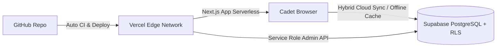

# WHYNOTUPSC / REDROOM — UPSC CIVIL SERVICES OS

A tactical, high-performance operating system and preparation workspace for UPSC Civil Services aspirants.

---

## ⚡ Tri-Platform Integration: GitHub ↔ Vercel ↔ Supabase

This application is architected to run seamlessly on **Vercel** connected to **GitHub**, with **Supabase** providing PostgreSQL database persistence, Row Level Security (RLS), and real-time sync.



---

## 🚀 3-Step Setup & Deployment Guide

### Step 1: Set Up Supabase Database

1. Create a project at [supabase.com](https://supabase.com).
2. Open the **SQL Editor** in your Supabase dashboard.
3. Open [`supabase/full_production_schema.sql`](supabase/full_production_schema.sql), copy its entire contents, paste into the SQL editor, and click **Run**.
4. Navigate to **Project Settings > API** and copy:
   - **Project URL**
   - **anon / public key**
   - **service_role key** (keep secret!)

---

### Step 2: Push to GitHub & Connect to Vercel

1. Commit your codebase and push to your GitHub repository:
   ```bash
   git add .
   git commit -m "feat: complete Supabase-Vercel-GitHub integration"
   git push origin main
   ```
2. In [vercel.com](https://vercel.com), click **Add New > Project** and import your GitHub repository.
3. In the **Environment Variables** section on Vercel, add:

| Key | Value Description | Visibility |
|---|---|---|
| `NEXT_PUBLIC_SUPABASE_URL` | `https://<your-project>.supabase.co` | Public |
| `NEXT_PUBLIC_SUPABASE_ANON_KEY` | `eyJhbGciOi...` (Supabase Anon Key) | Public |
| `SUPABASE_SERVICE_ROLE_KEY` | `eyJhbGciOi...` (Supabase Service Role Key) | Encrypted |
| `HF_TOKEN` | (Optional) Hugging Face token for AI inference | Encrypted |
| `TELEGRAM_BOT_TOKEN` | (Optional) Telegram bot token for alerts | Encrypted |

4. Click **Deploy**. Vercel will automatically build and deploy the Next.js application. Every subsequent `git push` to `main` will trigger an automated zero-downtime deployment.

---

### Step 3: Configure GitHub Actions CI

To verify builds and type-safety automatically on pull requests and pushes:

1. In your GitHub repository, go to **Settings > Secrets and variables > Actions**.
2. Add the repository secrets:
   - `NEXT_PUBLIC_SUPABASE_URL`
   - `NEXT_PUBLIC_SUPABASE_ANON_KEY`
   - `SUPABASE_SERVICE_ROLE_KEY`
3. GitHub Actions will automatically execute `.github/workflows/ci.yml` on every commit.

---

## 🛡️ Super Administrator Clearance

- **Email:** `whynotupsc@wacky.com`
- **Password:** `wacky@0808`
- **Role:** `SUPER_ADMIN` (Full access to `/admin` and telemetry monitors)

---

## 🛠️ Local Development

```bash
# Install dependencies
npm install

# Run type checker
npx tsc --noEmit

# Run local development server
npm run dev

# Run production build test
npm run build
```
